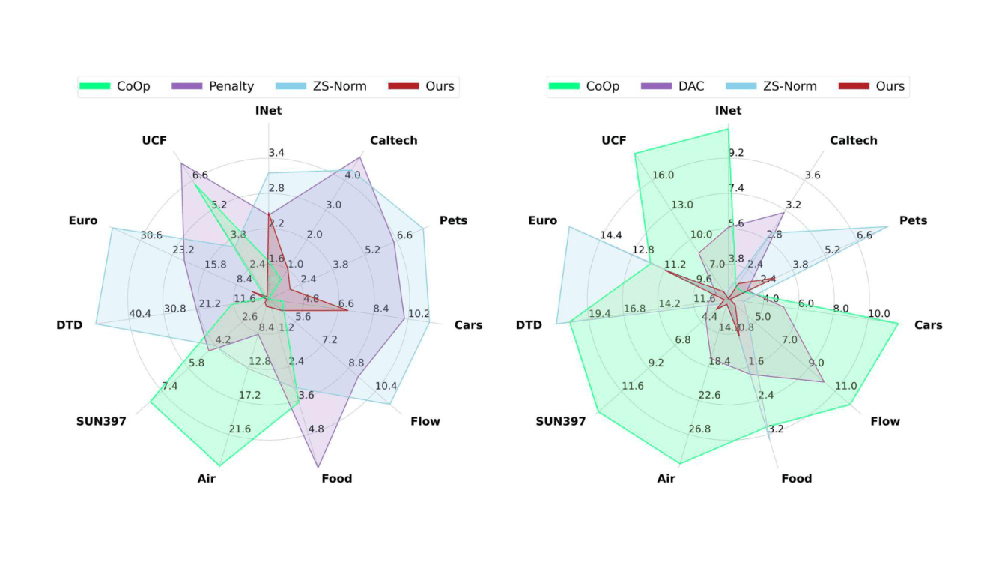
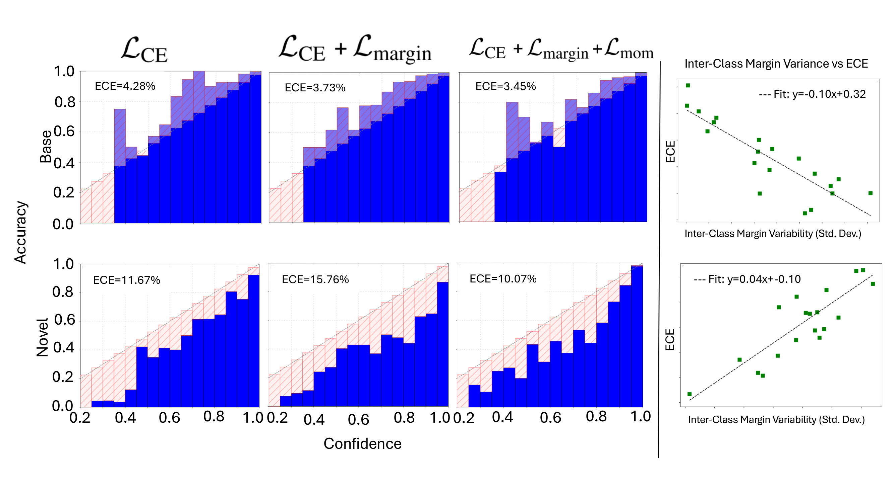

# Towards Calibrating Prompt Tuning of Vision- Language Models [CVPR 2026]

# 🚀 Towards Calibrating Prompt Tuning of Vision-Language Models (CVPR 2026)

Code and resources for our CVPR 2026 paper on calibrating prompt tuning in vision-language models.

[]()
[](https://arxiv.org/abs/2602.19024)
[]()

## ✍️ Authors
- **[Ashshak Sharifdeen](https://scholar.google.com/citations?user=rd9zSX8AAAAJ&hl=en)**
- **[Fahad Shamshad](https://scholar.google.com/citations?user=d7QL4wkAAAAJ&hl=en)**
- **[Muhammad Akhtar Munir](https://scholar.google.com/citations?user=sT-epZAAAAAJ&hl=en)**
- **[Mohamed Insaf Ismithdeen](https://scholar.google.com/citations?user=--fYSbUAAAAJ&hl=en)**
- **[Jeyapriyan Jeyamohan](https://www.linkedin.com/in/jeyamohan-jeyapriyan-60246a201/?originalSubdomain=lk)**
- **[Chathurika Sewwandi Silva](https://scholar.google.com/citations?user=LslXPjoAAAAJ&hl=en)**
- **[Karthik Nandakumar](https://scholar.google.com/citations?user=2qx0RnEAAAAJ&hl=en)**
- **[Muhammad Haris Khan](https://scholar.google.com/citations?user=ZgERfFwAAAAJ&hl=en)**

---

## 📌 Overview

Prompt tuning is a powerful adaptation strategy for vision-language models, but it often leads to suboptimal confidence calibration, especially when transferring from base classes to novel classes. In this work, we study the calibration behavior of prompt-tuned models and propose a principled approach that improves Expected Calibration Error (ECE) while preserving strong classification performance.

Our contributions are summarized as follows:

- We analyze the calibration behavior of prompt-tuned vision-language models and identify key factors behind miscalibration on both base and novel classes.
- We propose a new calibration framework for prompt tuning that explicitly regularizes the learned prompt/text space for improved confidence reliability.
- We show that our method consistently improves calibration performance across multiple prompt-tuning baselines and 11 fine-grained classification benchmarks.
- We provide extensive empirical analysis demonstrating improved ECE with competitive or better accuracy across both base and novel splits.

---

## 📈 Main Figures

> **Note:** Save your attached figure PDFs as image files before using them in GitHub README rendering.  
> Recommended filenames:
> - `assets/main_figure.png`  ← exported from your main figure PDF
> - `assets/motivation_figure.png` ← exported from your motivation PDF

<p align="center">
  
</p>

<p align="center">
  <em>Overall calibration comparison across prompt-tuning baselines and datasets.</em>
</p>

<p align="center">
  
</p>

<p align="center">
  <em>Motivation and analysis of calibration behavior in prompt-tuned vision-language models.</em>
</p>

---

## 📥 Installation

We follow the official **MaPLe** repository for environment setup and dataset preparation:

- **MaPLe repository:** https://github.com/muzairkhattak/multimodal-prompt-learning?tab=readme-ov-file

Please use the same environment configuration and dataset preparation pipeline as MaPLe.

---

## 📂 Datasets

We evaluate on 11 fine-grained classification benchmarks commonly used in prompt-tuning literature:

1. ImageNet
2. Caltech101
3. OxfordPets
4. StanfordCars
5. Flowers102
6. Food101
7. FGVCAircraft
8. SUN397
9. DTD
10. EuroSAT
11. UCF101

---

## 📊 Main Results

We report **Top-1 Accuracy (Acc.)** and **Expected Calibration Error (ECE)** on both **base** and **novel** classes. Higher accuracy is better, while lower ECE indicates better calibration.

**Dataset abbreviations:**  
`INet` = ImageNet, `Cal` = Caltech101, `Pets` = OxfordPets, `Cars` = StanfordCars, `Flow` = Flowers102, `Food` = Food101, `Air` = FGVCAircraft, `SUN` = SUN397, `DTD` = DTD, `Euro` = EuroSAT, `UCF` = UCF101.

---

## Table 1. Base-Class Results

### Zero-Shot Reference

| Method | Metric | INet | Cal | Pets | Cars | Flow | Food | Air | SUN | DTD | Euro | UCF | Avg |
|---|---|---:|---:|---:|---:|---:|---:|---:|---:|---:|---:|---:|---:|
| Zero Shot | Acc. | 72.40 | 97.20 | 91.30 | 63.60 | 71.80 | 90.10 | 27.70 | 69.40 | 53.00 | 57.00 | 71.00 | 69.50 |
| Zero Shot | ECE  | 1.51 | 6.49 | 2.25 | 3.74 | 3.11 | 1.57 | 3.03 | 1.59 | 4.53 | 8.35 | 3.24 | 3.58 |

### CoOp-based Methods

| Method | Metric | INet | Cal | Pets | Cars | Flow | Food | Air | SUN | DTD | Euro | UCF | Avg |
|---|---|---:|---:|---:|---:|---:|---:|---:|---:|---:|---:|---:|---:|
| CoOp | Acc. | 75.60 | 97.98 | 94.77 | 76.22 | 90.00 | 90.20 | 35.23 | 81.14 | 76.27 | 90.24 | 83.32 | 81.00 |
| CoOp | ECE  | 1.65 | 0.66 | 1.00 | 3.73 | 4.93 | 3.66 | 25.70 | 8.11 | 12.17 | 1.75 | 6.44 | 6.35 |
| MBLS | Acc. | 75.12 | 97.89 | 91.11 | 76.21 | 89.34 | 89.78 | 34.32 | 81.32 | 76.34 | 90.12 | 82.78 | 80.39 |
| MBLS | ECE  | 2.98 | 9.60 | 7.70 | 12.20 | 5.69 | 12.34 | 10.48 | 16.80 | 4.25 | 8.02 | 9.39 | 9.04 |
| Temp. Scal. | Acc. | 75.60 | 98.19 | 94.15 | 78.65 | 97.72 | 90.10 | 42.00 | 81.32 | 80.67 | 90.70 | 84.56 | 83.06 |
| Temp. Scal. | ECE  | 1.50 | 1.20 | 2.54 | 6.65 | 4.60 | 0.50 | 3.43 | 2.01 | 3.86 | 4.76 | 1.57 | 2.96 |
| DAC | Acc. | - | - | - | - | - | - | - | - | - | - | - | - |
| DAC | ECE  | - | - | - | - | - | - | - | - | - | - | - | - |
| ZS-Norm | Acc. | 76.10 | 97.85 | 94.38 | 77.78 | 95.76 | 89.52 | 39.74 | 81.37 | 81.02 | 90.45 | 84.01 | 82.54 |
| ZS-Norm | ECE  | 3.15 | 4.35 | 7.75 | 11.30 | 11.29 | 3.14 | 13.05 | 4.22 | 49.53 | 37.04 | 3.47 | 13.48 |
| Penalty | Acc. | 76.44 | 97.72 | 95.11 | 77.05 | 96.30 | 87.92 | 38.07 | 81.04 | 77.32 | 47.09 | 80.47 | 77.68 |
| Penalty | ECE  | 2.43 | 4.79 | 6.47 | 10.01 | 9.38 | 5.98 | 8.59 | 4.59 | 21.84 | 20.47 | 7.42 | 9.27 |
| **Ours** | **Acc.** | **76.53** | **98.06** | **94.95** | **77.32** | **97.21** | **90.38** | **38.62** | **81.68** | **80.44** | **88.56** | **84.68** | **82.58** |
| **Ours** | **ECE**  | **2.47** | **1.01** | **1.94** | **7.10** | **4.80** | **0.30** | **4.96** | **1.22** | **2.42** | **4.90** | **1.11** | **2.93** |

### MaPLe-based Methods

| Method | Metric | INet | Cal | Pets | Cars | Flow | Food | Air | SUN | DTD | Euro | UCF | Avg |
|---|---|---:|---:|---:|---:|---:|---:|---:|---:|---:|---:|---:|---:|
| MaPLe | Acc. | 76.71 | 97.97 | 95.53 | 72.93 | 95.00 | 90.80 | 36.33 | 80.55 | 79.63 | 91.13 | 83.20 | 82.41 |
| MaPLe | ECE  | 2.27 | 1.54 | 2.68 | 7.25 | 4.28 | 0.78 | 3.86 | 1.27 | 4.18 | 3.42 | 2.68 | 3.19 |
| MBLS | Acc. | 75.59 | 98.23 | 95.23 | 72.77 | 95.93 | 90.80 | 36.20 | 80.73 | 80.03 | 90.93 | 84.13 | 82.50 |
| MBLS | ECE  | 29.06 | 5.03 | 6.64 | 19.06 | 12.74 | 6.55 | 5.60 | 11.01 | 4.79 | 3.73 | 8.46 | 8.36 |
| Temp. Scal. | Acc. | 76.66 | 97.97 | 94.93 | 72.70 | 95.93 | 90.63 | 36.37 | 80.73 | 78.60 | 93.60 | 84.00 | 82.55 |
| Temp. Scal. | ECE  | 2.37 | 1.26 | 2.28 | 4.96 | 3.44 | 0.71 | 3.04 | 2.84 | 5.98 | 1.31 | 3.07 | 2.89 |
| DAC | Acc. | - | - | - | - | - | - | - | - | - | - | - | - |
| DAC | ECE  | - | - | - | - | - | - | - | - | - | - | - | - |
| ZS-Norm | Acc. | 76.63 | 97.57 | 95.70 | 73.07 | 95.63 | 90.57 | 36.00 | 80.97 | 80.43 | 91.30 | 83.87 | 82.51 |
| ZS-Norm | ECE  | 1.64 | 23.30 | 5.91 | 8.66 | 11.49 | 1.13 | 7.87 | 2.33 | 7.02 | 19.38 | 3.86 | 9.10 |
| Penalty | Acc. | 76.72 | 98.07 | 95.30 | 72.43 | 95.77 | 90.73 | 34.33 | 80.93 | 64.60 | 36.77 | 83.03 | 75.20 |
| Penalty | ECE  | 3.87 | 5.41 | 6.37 | 13.53 | 12.67 | 3.87 | 8.42 | 7.28 | 19.97 | 13.43 | 8.50 | 9.95 |
| **Ours** | **Acc.** | **76.72** | **97.97** | **94.93** | **72.80** | **96.20** | **90.43** | **36.80** | **81.10** | **80.73** | **92.00** | **84.50** | **82.75** |
| **Ours** | **ECE**  | **2.39** | **1.19** | **1.54** | **7.92** | **3.45** | **0.65** | **4.50** | **1.55** | **3.56** | **1.33** | **2.12** | **2.78** |

### KGCoOp-based Methods

| Method | Metric | INet | Cal | Pets | Cars | Flow | Food | Air | SUN | DTD | Euro | UCF | Avg |
|---|---|---:|---:|---:|---:|---:|---:|---:|---:|---:|---:|---:|---:|
| KGCoOp | Acc. | 75.75 | 97.70 | 94.68 | 72.70 | 95.16 | 90.57 | 36.77 | 80.59 | 79.40 | 86.14 | 83.51 | 81.18 |
| KGCoOp | ECE  | 2.52 | 2.92 | 3.27 | 10.16 | 12.12 | 1.68 | 3.27 | 4.92 | 8.39 | 11.90 | 5.03 | 6.02 |
| MBLS | Acc. | 76.23 | 97.81 | 95.00 | 75.34 | 96.24 | 90.49 | 38.28 | 80.86 | 79.94 | 87.96 | 83.45 | 81.96 |
| MBLS | ECE  | 6.19 | 4.30 | 5.26 | 13.43 | 12.48 | 4.08 | 8.01 | 8.16 | 9.03 | 11.97 | 5.86 | 8.07 |
| Temp. Scal. | Acc. | 75.77 | 97.66 | 94.67 | 70.08 | 94.65 | 90.50 | 35.81 | 80.51 | 78.74 | 86.44 | 83.32 | 80.74 |
| Temp. Scal. | ECE  | 6.47 | 4.16 | 5.13 | 11.70 | 15.35 | 3.64 | 7.41 | 8.50 | 11.12 | 15.79 | 7.39 | 8.79 |
| DAC | Acc. | - | - | - | - | - | - | - | - | - | - | - | - |
| DAC | ECE  | - | - | - | - | - | - | - | - | - | - | - | - |
| ZS-Norm | Acc. | 75.78 | 94.14 | 97.65 | 74.55 | 73.90 | 91.71 | 30.79 | 76.50 | 51.49 | 65.39 | 76.44 | 73.49 |
| ZS-Norm | ECE  | 2.70 | 1.65 | 3.51 | 3.85 | 4.72 | 2.20 | 8.42 | 3.23 | 6.37 | 6.16 | 3.83 | 4.24 |
| Penalty | Acc. | 75.65 | 97.70 | 94.68 | 72.45 | 93.86 | 90.59 | 37.76 | 80.63 | 78.40 | 83.09 | 82.97 | 80.71 |
| Penalty | ECE  | 2.73 | 3.27 | 3.22 | 10.58 | 13.01 | 1.73 | 9.59 | 6.51 | 20.40 | 6.51 | 6.07 | 7.57 |
| **Ours** | **Acc.** | **75.84** | **97.68** | **94.84** | **71.65** | **95.22** | **90.52** | **36.03** | **80.70** | **78.47** | **85.10** | **83.16** | **80.34** |
| **Ours** | **ECE**  | **2.14** | **1.88** | **2.96** | **8.10** | **11.21** | **1.12** | **4.81** | **4.12** | **7.01** | **12.64** | **4.14** | **5.47** |

---

## Table 2. Novel-Class Results

### Zero-Shot Reference

| Method | Metric | INet | Cal | Pets | Cars | Flow | Food | Air | SUN | DTD | Euro | UCF | Avg |
|---|---|---:|---:|---:|---:|---:|---:|---:|---:|---:|---:|---:|---:|
| Zero Shot | Acc. | 72.40 | 94.10 | 97.10 | 75.00 | 77.50 | 91.10 | 35.90 | 75.50 | 60.60 | 63.80 | 78.60 | 74.30 |
| Zero Shot | ECE  | 2.09 | 1.55 | 3.42 | 3.31 | 4.91 | 1.83 | 6.55 | 3.48 | 6.86 | 9.12 | 5.52 | 4.43 |

### CoOp-based Methods

| Method | Metric | INet | Cal | Pets | Cars | Flow | Food | Air | SUN | DTD | Euro | UCF | Avg |
|---|---|---:|---:|---:|---:|---:|---:|---:|---:|---:|---:|---:|---:|
| CoOp | Acc. | 59.07 | 94.18 | 96.49 | 65.29 | 69.90 | 90.57 | 24.79 | 70.77 | 52.98 | 64.68 | 62.83 | 68.32 |
| CoOp | ECE  | 10.69 | 2.16 | 1.67 | 11.73 | 12.13 | 3.03 | 30.44 | 13.70 | 20.82 | 11.88 | 18.74 | 12.45 |
| MBLS | Acc. | 59.11 | 95.10 | 96.23 | 65.28 | 69.89 | 90.23 | 24.80 | 70.12 | 53.12 | 64.65 | 62.97 | 68.31 |
| MBLS | ECE  | 4.09 | 2.21 | 3.45 | 9.70 | 18.90 | 13.80 | 10.20 | 9.70 | 8.90 | 12.10 | 13.21 | 9.66 |
| Temp. Scaling | Acc. | 59.07 | 93.45 | 96.03 | 66.70 | 65.86 | 96.60 | 27.37 | 70.67 | 48.19 | 54.70 | 57.51 | 66.92 |
| Temp. Scaling | ECE  | 7.33 | 3.17 | 3.65 | 5.01 | 8.06 | 1.06 | 18.80 | 6.93 | 20.21 | 15.13 | 14.55 | 9.45 |
| DAC | Acc. | - | - | - | - | - | - | - | - | - | - | - | - |
| DAC | ECE  | 5.67 | 3.17 | 1.82 | 5.16 | 10.19 | 1.78 | 17.38 | 4.05 | 10.48 | 8.62 | 8.67 | 7.00 |
| ZS-Norm | Acc. | 66.26 | 93.30 | 93.98 | 66.62 | 67.21 | 88.91 | 25.76 | 70.51 | 44.08 | 50.42 | 62.52 | 66.32 |
| ZS-Norm | ECE  | 2.46 | 2.89 | 7.94 | 2.87 | 4.41 | 3.32 | 10.18 | 2.47 | 21.80 | 15.93 | 4.28 | 7.14 |
| Penalty | Acc. | 66.71 | 92.87 | 96.14 | 68.11 | 68.65 | 78.34 | 29.29 | 71.65 | 40.78 | 41.44 | 67.53 | 65.59 |
| Penalty | ECE  | 2.36 | 2.52 | 7.42 | 2.73 | 4.93 | 4.70 | 7.81 | 2.79 | 4.20 | 13.11 | 4.66 | 5.20 |
| **Ours** | **Acc.** | **67.03** | **93.56** | **97.36** | **69.49** | **71.63** | **90.84** | **30.83** | **70.03** | **48.07** | **56.70** | **66.49** | **69.28** |
| **Ours** | **ECE**  | **2.02** | **2.21** | **3.03** | **2.10** | **3.51** | **0.87** | **10.64** | **3.08** | **9.31** | **11.15** | **4.75** | **4.79** |

### MaPLe-based Methods

| Method | Metric | INet | Cal | Pets | Cars | Flow | Food | Air | SUN | DTD | Euro | UCF | Avg |
|---|---|---:|---:|---:|---:|---:|---:|---:|---:|---:|---:|---:|---:|
| MaPLe | Acc. | 70.50 | 95.10 | 97.85 | 73.57 | 72.80 | 92.10 | 34.53 | 78.20 | 58.47 | 75.90 | 77.85 | 75.17 |
| MaPLe | ECE  | 1.93 | 1.62 | 2.63 | 3.09 | 11.67 | 1.19 | 11.24 | 2.21 | 12.16 | 11.68 | 3.98 | 5.76 |
| MBLS | Acc. | 68.47 | 94.17 | 96.97 | 71.93 | 68.93 | 91.46 | 33.77 | 78.10 | 54.70 | 75.97 | 78.23 | 73.88 |
| MBLS | ECE  | 22.82 | 4.06 | 7.41 | 11.41 | 4.84 | 7.06 | 6.06 | 10.41 | 10.31 | 11.25 | 6.63 | 9.30 |
| Temp. Scaling | Acc. | 70.46 | 94.83 | 97.30 | 73.47 | 72.77 | 91.77 | 34.07 | 78.13 | 57.97 | 73.77 | 75.33 | 74.53 |
| Temp. Scaling | ECE  | 1.95 | 2.56 | 2.13 | 4.08 | 12.76 | 0.72 | 19.11 | 5.09 | 16.47 | 8.05 | 7.13 | 7.28 |
| DAC | Acc. | - | - | - | - | - | - | - | - | - | - | - | - |
| DAC | ECE  | 2.11 | 1.26 | 2.51 | 2.75 | 11.28 | 1.50 | 9.06 | 1.22 | 8.16 | 8.55 | 2.30 | 4.61 |
| ZS-Norm | Acc. | 70.63 | 90.30 | 97.23 | 73.30 | 70.03 | 91.83 | 34.07 | 78.47 | 60.70 | 68.13 | 77.80 | 73.86 |
| ZS-Norm | ECE  | 3.67 | 23.02 | 5.00 | 3.26 | 6.05 | 1.62 | 7.82 | 2.65 | 5.23 | 14.53 | 3.33 | 6.93 |
| Penalty | Acc. | 70.66 | 93.60 | 97.33 | 73.90 | 70.87 | 91.90 | 34.70 | 78.67 | 45.47 | 36.77 | 76.83 | 70.06 |
| Penalty | ECE  | 1.49 | 3.25 | 6.23 | 5.94 | 5.76 | 4.27 | 4.92 | 5.70 | 8.47 | 13.35 | 6.07 | 5.95 |
| **Ours** | **Acc.** | **70.28** | **94.87** | **97.57** | **75.27** | **73.87** | **91.77** | **36.03** | **78.13** | **61.27** | **67.60** | **79.87** | **75.14** |
| **Ours** | **ECE**  | **1.74** | **1.42** | **2.29** | **2.60** | **10.07** | **0.86** | **8.33** | **1.11** | **7.37** | **7.45** | **3.32** | **4.23** |

### KGCoOp-based Methods

| Method | Metric | INet | Cal | Pets | Cars | Flow | Food | Air | SUN | DTD | Euro | UCF | Avg |
|---|---|---:|---:|---:|---:|---:|---:|---:|---:|---:|---:|---:|---:|
| KGCoOp | Acc. | 69.70 | 94.43 | 97.67 | 74.25 | 75.10 | 91.65 | 36.77 | 76.33 | 54.23 | 64.68 | 75.59 | 73.67 |
| KGCoOp | ECE  | 1.84 | 1.71 | 3.42 | 3.36 | 5.03 | 2.04 | 6.06 | 1.66 | 4.38 | 8.67 | 2.65 | 3.71 |
| MBLS | Acc. | 69.14 | 94.32 | 94.24 | 73.01 | 73.90 | 90.49 | 28.87 | 75.75 | 56.28 | 64.27 | 73.84 | 72.19 |
| MBLS | ECE  | 4.60 | 1.62 | 3.16 | 3.95 | 4.00 | 4.00 | 11.39 | 5.56 | 3.23 | 5.30 | 4.10 | 4.63 |
| Temp. Scaling | Acc. | 69.79 | 94.54 | 97.56 | 74.94 | 75.37 | 91.66 | 32.35 | 76.79 | 53.83 | 62.17 | 76.91 | 73.27 |
| Temp. Scaling | ECE  | 5.81 | 1.89 | 4.91 | 6.35 | 4.63 | 4.02 | 5.40 | 6.18 | 3.83 | 7.60 | 6.43 | 5.18 |
| DAC | Acc. | - | - | - | - | - | - | - | - | - | - | - | - |
| DAC | ECE  | 4.32 | 1.84 | 3.11 | 3.12 | 5.90 | 1.94 | 11.78 | 1.67 | 7.09 | 6.59 | 2.69 | 4.47 |
| ZS-Norm | Acc. | 69.68 | 94.14 | 97.65 | 74.55 | 73.90 | 91.71 | 30.79 | 76.50 | 51.49 | 65.39 | 76.44 | 72.19 |
| ZS-Norm | ECE  | 1.80 | 1.65 | 3.51 | 3.85 | 4.72 | 2.20 | 8.42 | 3.23 | 6.37 | 6.16 | 3.83 | 4.16 |
| Penalty | Acc. | 69.58 | 94.34 | 96.35 | 74.75 | 73.21 | 91.31 | 30.58 | 76.69 | 51.19 | 65.43 | 76.52 | 72.99 |
| Penalty | ECE  | 1.82 | 1.71 | 4.21 | 3.05 | 5.12 | 2.99 | 8.12 | 4.13 | 5.87 | 6.56 | 3.93 | 4.75 |
| **Ours** | **Acc.** | **69.50** | **94.21** | **97.72** | **74.39** | **73.80** | **91.64** | **31.63** | **76.30** | **55.92** | **65.76** | **76.62** | **73.41** |
| **Ours** | **ECE**  | **1.84** | **1.22** | **3.50** | **3.60** | **4.78** | **1.61** | **7.67** | **1.91** | **3.37** | **4.15** | **3.01** | **3.33** |

---

## 🔍 Summary of Results

- On **base classes**, our method achieves strong calibration improvements across CoOp, MaPLe, and KGCoOp backbones, with especially competitive average ECE values.
- On **novel classes**, our method consistently reduces calibration error while maintaining competitive classification accuracy.
- In several settings, our method improves average ECE substantially over prior calibration baselines and remains competitive with zero-shot CLIP calibration.

---

## 🙏 Acknowledgement

We thank the authors of the following repositories for making their code publicly available:

- [MaPLe](https://github.com/muzairkhattak/multimodal-prompt-learning?tab=readme-ov-file)
- [CoOp / CoCoOp](https://github.com/KaiyangZhou/CoOp)
- Related prompt-tuning and calibration baselines used in this work

---

## 📖 Citation

If you find our work useful for your research, please consider citing:

```bibtex
@misc{sharifdeen2026calibratingprompttuningvisionlanguage,
      title={Towards Calibrating Prompt Tuning of Vision-Language Models}, 
      author={Ashshak Sharifdeen and Fahad Shamshad and Muhammad Akhtar Munir and Abhishek Basu and Mohamed Insaf Ismithdeen and Jeyapriyan Jeyamohan and Chathurika Sewwandi Silva and Karthik Nandakumar and Muhammad Haris Khan},
      year={2026},
      eprint={2602.19024},
      archivePrefix={arXiv},
      primaryClass={cs.CV},
      url={https://arxiv.org/abs/2602.19024}, 
}


